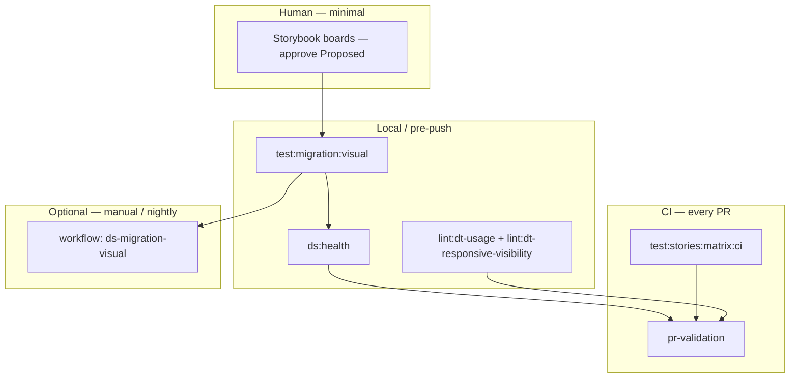

# Design system automation strategy

> Solo-studio leverage: governance that runs without babysitting, visible compliance without gatekeeping, and automation that unblocks client work.

**Related:** [`SHADCN_TO_DT_MIGRATION.md`](SHADCN_TO_DT_MIGRATION.md) · [`AGENTIC_DS_OPERATING_MODEL.md`](AGENTIC_DS_OPERATING_MODEL.md) · Storybook **Design system / Migration boards**

---

## Intent

| Goal | What it means here |
|------|-------------------|
| **Scale without hires** | Tooling enforces DS rules; future collaborators inherit boards + CI, not oral tradition. |
| **Time → revenue** | Less manual review and regression firefighting → more client delivery. |
| **Trust** | Every engagement can show theme × viewport evidence, not “trust me.” |
| **Opinionated, not restrictive** | APIs like `Button.surface` encode real failures (HomeHero ≠ CTA band); defer lanes stay explicit. |
| **Optional product** | Baseline audits, migration matrices, and drift reports can become billable offerings. |

---

## Three pillars (from studio strategy)

### 1. Observable governance

Teams (currently: you) see **what passed, what’s blocked, and why** without a review meeting.

| Artifact | Role |
|----------|------|
| **Migration decision boards** | Legacy / Wrong / Proposed / Defer per real background |
| **Review hub** | Storybook index → board stories |
| **`npm run ds:health`** | Single JSON + markdown summary for CI / PR |
| **`public/visual-diff/migration-matrix-report.json`** | Last migration visual matrix run |
| **PR validation** | Existing gates + `ds:health` |

Principle: CI should feel **helpful** (“96/96 matrix checks”) not punitive opaque logs.

### 2. Invisible enforcement

Rules apply in the background; humans only engage when something breaks.

| Mechanism | Enforces |
|-----------|----------|
| `lint:dt-usage` | No new `@/components/ui/*` in `app/` (strict in CI) |
| `lint:dt-responsive-visibility` | No responsive `hidden`/`flex`/… on `@dt/Button` (use wrapper — see IconButton) |
| `test:stories:matrix:ci` | AT-tree snapshots, light + dark, `beta-matrix` stories |
| `test:migration:visual` | 4 themes × desktop/mobile + menu layout guards |
| `validate:components` + contrast / figma checks | Contract and token discipline |

**Process (non-negotiable):** no production swap until the green **Proposed** row is approved on the right board *and* relevant automation passes.

### 3. Complex pain (differentiation)

Where clients pay: **a11y at scale**, **multi-brand / multi-theme**, **code ↔ Figma parity**, **cross-surface consistency**.

This repo already seeds: 4-theme visual matrix, Figma variable phases, page-level Playwright a11y specs, agent manifest + evals.

---

## What we proved in the shadcn → `@dt` migration

| Pattern | Lesson |
|---------|--------|
| Decision boards | Subjective “looks fine” → repeatable approval artifact |
| `surface` on Button | Static CSS beats `isInverse` on gradients |
| IconButton + `lg:hidden` | CSS module `display` beats Tailwind on the same node → **wrapper span** |
| Modal board **blocked** | Half-migrations are worse than defer |
| `nextjs-app/tsconfig` paths | `@/` must resolve to repo root for `shared/` |

---

## Automation map



---

## Commands (contributor checklist)

```bash
# Fast governance snapshot (CI-safe, no servers)
npm run ds:health

# Before merging DS / migration touchpoints
npm run lint:dt-usage
npm run lint:dt-responsive-visibility
npm run validate:components

# Storybook on :6010 + dev on :3001
npm run test:migration:visual
# Refresh baselines after intentional visual change:
npm run test:migration:visual:update

# Structural regression (CI runs this)
npm run test:stories:matrix:ci
```

---

## 90-day priorities (solo, revenue-focused)

### Month 1 — Lock the foundation

- [x] Migration boards + visual matrix + menu layout guards
- [x] `ds:health` + responsive visibility lint
- [ ] Wire optional `ds-migration-visual` workflow (manual dispatch)
- [ ] PR template checklist for DS-touching PRs
- [ ] Finish **approved** migration rows only; keep Modal **blocked**

### Month 2 — Client leverage

- [ ] “Site baseline” script: run a11y + visual matrix against staging URL → stored report
- [ ] One-pager for proposals using matrix screenshots
- [x] Expand `lint:dt-usage` to `shared/patterns` and `shared/components/pages` (import policy only)

### Month 3 — Scale decision

- [ ] First paid “DS audit” pilot using existing reports
- [ ] Hire **or** productize automation — based on margin, not hope

---

## Blocked / defer (do not automate away)

| Area | Status |
|------|--------|
| `@dt/Modal` vs shadcn Dialog | **Blocked** — board must pass first |
| Composable Radix DialogTrigger | **Defer** |
| EnhancedContactForm full stack | **Defer** until primitives exist |

---

## External one-liner

> We treat design system compliance like production infrastructure: critical UI is compared across four themes and two viewports, with explicit approve/defer lanes, before it ships.

---

## Service packaging (optional)

| Offering | Built from |
|----------|------------|
| Pre-launch visual + layout audit | `test:migration:visual` + guards |
| Accessibility baseline | `tests/a11y/page-verification` |
| shadcn → `@dt` migration | Decision boards + `SHADCN_TO_DT_MIGRATION.md` |
| Token / Figma drift | `build:figma-variables`, `check:figma` |
| Governance retainer | `ds:health` + CI artifacts monthly |

Only sell what runs **without custom babysitting** per client — templatize thresholds and reports first.

---

## Maintenance

When adding automation:

1. Update this doc + [`scripts/AGENTS.md`](../scripts/AGENTS.md)
2. Add npm script + (if CI-safe) entry in [`.github/workflows/pr-validation.yml`](../.github/workflows/pr-validation.yml)
3. Link from [`AGENT_INDEX.md`](../AGENT_INDEX.md) quality gate section
