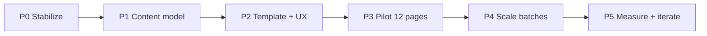

# PSEO Improvement Plan — Believable, Helpful Playbooks

**Status:** Phase 0 complete · Phase 1–2 in progress (2026-05-28)  
**Owner:** Digitaltableteur  
**Goal:** Turn `/pseo` from thin, repetitive “obvious PSEO” into expert playbooks that rank, convert, and genuinely help practitioners — without index-bloat or scaled-content-abuse risk.

> **Context:** May 2026 site audit flagged PSEO as the **#1 search risk**. Today all **100 leaf pages** share identical fallback copy; `copy.json` is empty; the UI says “Programmatic Guides” and breadcrumb “PSEO”.

---

## Diagnosis (current state)

| Signal | Today | Risk |
|--------|-------|------|
| Unique copy in `copy.json` | **0 / 100** pages | Thin / duplicate content |
| Fallback template | Same 4 sections on every leaf | Mad-libs pattern |
| Index H1 | “Programmatic Guides” | Self-identifies as PSEO |
| Breadcrumb label | “PSEO” | Jargon, not user intent |
| Title formula | `Service for Audience using Stack` + broken `titleCase` (“Next.Js”) | Low CTR, unprofessional |
| Proof / portfolio | None in body | No E-E-A-T |
| Package mapping | No link to `/pricing` packages | Weak conversion path |
| FAQ schema | Missing despite FAQ sections | Missed SERP features |
| Section render bug | Body markdown rendered **twice** per section | UX + crawl noise |
| Sitemap `lastModified` | Always “today” for all 115 URLs | Freshness spam |
| i18n | English only | OK for v1 if quality-first |

**Architecture is sound** (catalog → pillars → leaves → sitemap → agent tools). **Content and presentation are not.**

---

## Strategic shift

### From → To

| Old mental model | New mental model |
|------------------|------------------|
| 100 SEO landing pages | **Playbook library** for design-system practitioners |
| Swap keywords in one template | **Combo-specific** guidance (service × stack × audience) |
| Generate everything at once | **Progressive rollout** with quality gates |
| “Programmatic SEO” in UI | **“Design system playbooks”** (human language) |
| Generic CTA | **Contextual next step** (audit checklist → contact, package match → pricing) |

### Standalone value test (every published leaf must pass)

> *Would this page be worth publishing if no other similar page existed?*

If no → do not index until it passes.

---

## Target content model

Each leaf page should feel like a **senior consultant wrote one focused memo**, not a mail-merge.

### Required blocks (leaf template v2)

1. **Situation** — Who this is for, constraints of this audience + stack (2–3 sentences, combo-specific).
2. **What goes wrong** — 3–5 bullets grounded in real failure modes (not generic “inconsistency”).
3. **Playbook** — Numbered steps with stack-specific tactics (React vs Figma vs Storybook differ).
4. **Deliverables checklist** — Copy-paste checklist; varies by **service**.
5. **Proof** — Link to relevant `/work/*` case study or blog post (mapped in catalog).
6. **Package fit** — Which `/pricing` package applies and why (UX Sprint vs Design System Lift-Off, etc.).
7. **FAQ** — 2–3 Q&As that reference **this** combo (timeline, team size, existing codebase).
8. **Related guides** — 3–5 with **specific** “read this if…” reasons (already scaffolded).

### Catalog enrichment (`content/pseo/catalog.json` v2)

Extend items beyond `name` + `shortDescription`:

```jsonc
{
  "services": [{
    "slug": "design-system-audit",
    "painPoints": ["…"],
    "deliverables": ["…"],
    "typicalTimeline": "1–2 weeks",
    "pricingPackageSlug": "ux-sprint",
    "relatedWorkSlugs": ["helsinki-design-system"],
    "relatedBlogSlugs": ["…"]
  }],
  "stacks": [{
    "slug": "nextjs",
    "displayName": "Next.js",           // preserves “Next.js” casing
    "implementationNotes": ["App Router", "RSC boundaries", "…"]
  }],
  "audiences": [{
    "slug": "startups",
    "constraints": ["small team", "…"],
    "successMetric": "shippable MVP UI in 2–4 weeks"
  }]
}
```

### Copy storage

Keep `content/pseo/copy.json` for LLM-assisted **narrative** sections, but **never** publish a leaf without:

- Catalog-backed structured fields (deterministic, unique per combo)
- ≥40% unique word count vs any sibling page (automated check)
- Human review on pilot batch (100% review) and sample review on later batches (10%)

---

## Phased delivery



---

### Phase 0 — Stabilize & de-risk (1–2 days)

**Goal:** Stop actively harming UX/SEO while we rebuild content.

| Task | Files / area |
|------|----------------|
| Fix duplicate section render | `PseoLeafPage.tsx` (remove second `MarkdownMessage`) |
| Rename UI copy: “Design system playbooks” (not “Programmatic Guides”) | `PseoIndexPage.tsx`, metadata in `app/pseo/page.tsx` |
| Breadcrumb: “Guides” or “Playbooks” (not “PSEO”) | `PseoLeafPage.tsx` |
| Fix title casing (`Next.js`, `TypeScript`) | `lib/pseo/catalog.ts` — use `displayName` or preserve known tokens |
| **noindex** all leaf pages until pilot passes quality gate | `app/pseo/[slug]/page.tsx` metadata `robots: { index: false }` — remove after Phase 3 |
| Keep pillars + index indexed (hub pages) | pillars get editorial intros in Phase 2 |
| Sitemap: stable `lastModified` from `copy.updatedAt` or catalog version date | `app/sitemap.ts` |
| Add `scripts/pseo/check-pseo-quality.mjs` | uniqueness %, word count, missing proof links |

**Exit criteria:** Build green; no duplicate body; leaves noindex; quality script runs in CI.

---

### Phase 1 — Content model & generation (3–5 days)

**Goal:** Make uniqueness structurally inevitable, not prompt-hoped.

| Task | Detail |
|------|--------|
| Catalog v2 schema + migration | Enrich 4×5×5 entries with pain points, deliverables, work/blog links |
| Author **4 service canonical playbooks** (human-written, ~800 words each) | Source of truth for LLM; store in `content/pseo/canonical/` |
| Rewrite `generate-pseo-copy.ts` prompts | Inject canonical excerpts, anti-template rules, word-count floors, banned phrases (“This guide explains how…”) |
| Structured sections in code | Render checklist + proof + package blocks from catalog (not LLM) |
| Map services → pricing packages | Reuse `consulting-catalog.ts` / `PricingPageContent` package slugs |
| Map combos → work case studies | Manual curation table in catalog (quality > automation) |

**Exit criteria:** `--limit 3` generation produces visibly different pages; quality script passes on samples.

---

### Phase 2 — Template & hub redesign (3–4 days)

**Goal:** Pages look like editorial product content, not SEO filler.

| Task | Detail |
|------|--------|
| Leaf layout v2 | Situation / failure modes / playbook / checklist / proof card / package callout |
| Index page v2 | Hero + “Start here” paths (by role, by stack) + featured playbooks, not raw grids |
| Pillar pages v2 | 200–400 word editorial intro per pillar; “best for” and “not for” |
| Internal linking | Blog posts link to relevant playbooks; playbooks link to `/pricing`, `/contact?mode=book`, `/work/*` |
| Schema | `FAQPage` on leaves with unique FAQs; `HowTo` where playbook steps qualify |
| OG images | Combo-specific subtitle on dynamic OG (optional) |

**Exit criteria:** Storybook stories for new blocks; visual review on index + 1 leaf + 1 pillar.

---

### Phase 3 — Pilot launch (12 pages) (1 week)

**Goal:** Prove quality before scaling index.

**Pilot selection** (high intent, good proof coverage):

| Service | Stack | Audience | Rationale |
|---------|-------|----------|-----------|
| design-system-audit | react | startups | Core offer + strong portfolio |
| design-system-audit | nextjs | startups | Matches site stack |
| component-library-build | react | scaleups | High search intent |
| design-tokens-setup | figma | product-teams | Token expertise |
| ai-designops-automation | storybook | designops | Differentiated niche |
| … | … | … | **12 total** — fill from GSC/query research |

**Workflow:**

1. Enrich catalog entries for pilot slugs only  
2. `npm run pseo:generate -- --slugs <pilot-list>`  
3. **100% human edit** pass (Petri) — tone, accuracy, remove AI tells  
4. Quality script: ≥40% unique, ≥600 words, proof link present  
5. Remove `noindex` for pilot slugs only  
6. Submit sitemap; monitor GSC for 2–4 weeks  

**Exit criteria:** 12 indexed leaves pass quality script + manual review; avg time-on-page baseline captured.

---

### Phase 4 — Scale in batches (ongoing)

**Goal:** Grow to full 100 without penalty risk.

| Batch | Size | Review |
|-------|------|--------|
| Batch A | +25 pages | 100% review |
| Batch B–D | +25 each | 10% sample + automated gates |
| Long tail | Remaining | Consolidate or **noindex** combos with no proof / weak intent |

**Consolidation rule:** If two leaves would be >70% similar after generation, merge into one canonical page and redirect — do not publish both.

**Exit criteria:** Full cluster live or consciously pruned; noindex count documented.

---

### Phase 5 — Measure & iterate (continuous)

| Metric | Tool | Target |
|--------|------|--------|
| Indexation | GSC URL Inspection | Pilot pages indexed within 14 days |
| Impressions / CTR | GSC | CTR ↑ vs formula titles (after title rewrite) |
| Engagement | GA4 | Scroll depth, CTA clicks to contact/pricing |
| Conversion | Contact + `/contact?mode=book` | Track `data-donny-interest="pseo-contact"` |
| Uniqueness | `check-pseo-quality.mjs` | ≥40% on every published leaf |
| LLM citations | Manual / AEO checks | Playbooks cited with correct URLs |

---

## Quality gates (CI)

Add to PR validation when `content/pseo/**` changes:

```bash
node scripts/pseo/check-pseo-quality.mjs --min-unique-percent 40 --min-words 600
node scripts/pseo/check-pseo-quality.mjs --require-proof-link --require-package-link
```

**Hard stop:** Do not remove leaf `noindex` in bulk without `--approve-bulk-index` flag and audit log.

---

## Human-only steps

| Step | Owner | When |
|------|-------|------|
| Choose pilot 12 combos | Petri | Phase 3 start |
| Edit generated copy for voice & accuracy | Petri | After each batch |
| Map case studies to services (proof table) | Petri | Phase 1 |
| GSC baseline export (queries, impressions) | Petri | Before pilot index |
| Approve batch indexation (remove noindex) | Petri | After quality pass |
| Optional: FI/SV for top 10 playbooks only | Later | Post-EN validation |

---

## Immediate next actions (recommended order)

1. **Approve this plan** (or adjust scope: e.g. cap at 40 pages instead of 100).  
2. **Execute Phase 0** — quick fixes + leaf noindex (safe, same day).  
3. **Workshop pilot 12** — pick combos with portfolio backing.  
4. **Phase 1 catalog enrichment** — start with 4 services + 5 stacks depth.  

---

## Related docs

- [`docs/PSEO_LLM_LINK_BUILDING.md`](./PSEO_LLM_LINK_BUILDING.md) — current technical pipeline  
- [`docs/audits/2026-05-31-digitaltableteur-site-audit.md`](./audits/2026-05-31-digitaltableteur-site-audit.md) — PSEO risk flag  
- [`content/pseo/catalog.json`](../content/pseo/catalog.json) — data source  
- [`scripts/pseo/generate-pseo-copy.ts`](../scripts/pseo/generate-pseo-copy.ts) — generation script  

---

**End of plan.** Update **Status** at top when Phase 0 begins.
